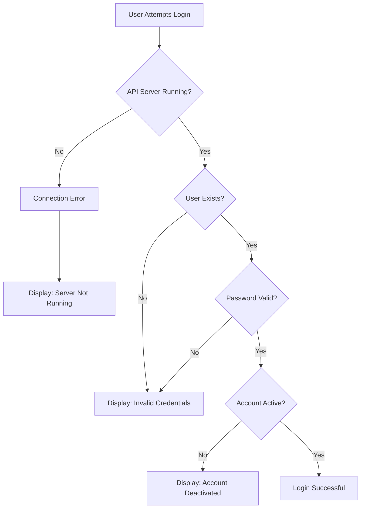

# Design Document: Authentication Access Fix

## Overview

This design addresses the authentication access issue in the MDJ Practice Manager application where users cannot login due to the API server not running and missing user data infrastructure. The solution focuses on ensuring proper server startup, data directory initialization, and clear user feedback for authentication failures.

## Architecture

### Current State

The application consists of two main components:
- **API Server** (NestJS): Backend on port 3001
- **Web Client** (Next.js): Frontend on localhost:3000

**Current Issues:**
1. API server is not running when users attempt to login
2. No `users` directory exists in `apps/api/data/`
3. No user records exist in the file storage system
4. Error messages don't clearly indicate server connectivity issues

### Target State

1. Both API server and web client running concurrently
2. File storage system properly initialized with required directories
3. Clear startup verification and health checks
4. Improved error handling and user feedback
5. Ability to create initial user accounts via registration

## Components and Interfaces

### 1. Server Startup Script

**Purpose**: Ensure both API and web servers start correctly

**Location**: Root `package.json` scripts

**Interface**:
```json
{
  "scripts": {
    "dev": "concurrently \"npm run dev:api\" \"npm run dev:web\"",
    "dev:api": "cd apps/api && npm run start:dev",
    "dev:web": "cd apps/web && npm run dev"
  }
}
```

**Behavior**:
- Start API server first (port 3001)
- Start web client second (localhost:3000)
- Use `concurrently` to run both processes
- Display clear console output for each service

### 2. File Storage Initialization

**Purpose**: Ensure required data directories exist before authentication operations

**Location**: `apps/api/src/modules/file-storage/file-storage.service.ts`

**Current Implementation**:
The `FileStorageService` already has directory creation logic in the `writeJson` method, but we need to ensure it's called for the `users` directory.

**Enhancement Needed**:
Add initialization method to create required directories on startup:

```typescript
async initializeDirectories(): Promise<void> {
  const requiredDirs = [
    'users',
    'user-sessions',
    'password-reset-tokens',
    'indexes/users-by-email'
  ];
  
  for (const dir of requiredDirs) {
    const dirPath = path.join(this.dataDir, dir);
    await fs.mkdir(dirPath, { recursive: true });
  }
}
```

### 3. Auth Service Enhancement

**Purpose**: Improve error handling and ensure proper directory structure

**Location**: `apps/api/src/modules/auth/auth.service.ts`

**Current Implementation**:
- Uses `fileStorageService.writeJson()` which creates directories
- Searches for users using `searchFiles()`
- Handles password hashing and token generation

**No Changes Required**: The current implementation already handles directory creation through the `writeJson` method. The issue is that no users have been created yet.

### 4. API Health Check Endpoint

**Purpose**: Allow web client to verify API server availability

**Location**: `apps/api/src/modules/auth/auth.controller.ts` or new health controller

**Interface**:
```typescript
@Get('health')
async healthCheck(): Promise<{ status: string; timestamp: Date }> {
  return {
    status: 'ok',
    timestamp: new Date()
  };
}
```

### 5. Web Client Error Handling

**Purpose**: Provide clear feedback when API server is unavailable

**Location**: `apps/web/src/lib/api.ts`

**Current Implementation**:
Already has error handling in the `request` method that catches fetch errors.

**Enhancement**:
Improve error messages to distinguish between:
- Network/connection errors (server not running)
- HTTP errors (server running but request failed)
- Authentication errors (invalid credentials)

```typescript
private async request<T>(endpoint: string, options: RequestInit = {}, retry = true): Promise<T> {
  try {
    const response = await fetch(url, config);
    // ... existing logic
  } catch (err) {
    // Enhanced error handling
    if (err instanceof TypeError && err.message.includes('fetch')) {
      throw new Error('Unable to connect to server. Please ensure the API server is running.');
    }
    throw err;
  }
}
```

### 6. Startup Documentation

**Purpose**: Provide clear instructions for starting the application

**Location**: `README.md` or new `GETTING_STARTED.md`

**Content**:
- Prerequisites (Node.js version, npm)
- Installation steps
- How to start the development servers
- How to create the first user account
- Troubleshooting common issues

## Data Models

### User Directory Structure

```
apps/api/data/
├── users/
│   └── {userId}.json          # User records
├── user-sessions/
│   └── {sessionId}.json       # Active sessions
├── password-reset-tokens/
│   └── {tokenId}.json         # Password reset tokens
└── indexes/
    └── users-by-email/
        └── {email}.json       # Email lookup index
```

### User Record Format

```typescript
{
  id: string;              // UUID
  email: string;           // Lowercase email
  firstName: string;
  lastName: string;
  passwordHash: string;    // bcrypt hash
  role: string;            // 'STAFF', 'MANAGER', 'ADMIN'
  portfolios: number[];    // Array of portfolio IDs
  isActive: boolean;
  emailVerified: boolean;
  createdAt: Date;
  updatedAt: Date;
  lastLoginAt?: Date;
}
```

## Error Handling

### Error Categories

1. **Server Connectivity Errors**
   - Symptom: Fetch fails, connection refused
   - Message: "Unable to connect to server. Please ensure the API server is running on port 3001."
   - Action: User should start the API server

2. **Authentication Errors**
   - Invalid credentials: "Invalid email or password"
   - Inactive account: "Account is deactivated"
   - Missing user: "Invalid credentials" (don't reveal if email exists)

3. **Registration Errors**
   - Duplicate email: "User with this email already exists"
   - Password mismatch: "Passwords do not match"
   - Terms not agreed: "You must agree to the terms and conditions"

### Error Flow



## Testing Strategy

### Manual Testing Steps

1. **Server Startup Test**
   - Stop all running servers
   - Run `npm run dev`
   - Verify API server starts on port 3001
   - Verify web client starts on localhost:3000
   - Check console for startup messages

2. **Registration Test**
   - Navigate to localhost:3000/register
   - Fill in registration form with valid data
   - Submit form
   - Verify user is created in `apps/api/data/users/`
   - Verify redirect to dashboard
   - Verify tokens stored in localStorage

3. **Login Test**
   - Logout if logged in
   - Navigate to localhost:3000/login
   - Enter registered email and password
   - Submit form
   - Verify successful login
   - Verify redirect to dashboard

4. **Error Handling Test**
   - Stop API server
   - Attempt to login
   - Verify clear error message about server connectivity
   - Restart API server
   - Attempt login with invalid credentials
   - Verify "Invalid credentials" message

5. **Demo Mode Test**
   - Click "Explore Demo" button
   - Verify demo user is loaded
   - Verify access to dashboard
   - Verify demo mode indicator
   - Logout and verify demo data cleared

### Automated Testing

Existing test files should cover:
- `apps/api/src/modules/auth/auth.service.spec.ts` - Auth service unit tests
- `apps/api/test/user-journey.e2e-spec.ts` - End-to-end user journey tests

**Additional Tests Needed**:
- Health check endpoint test
- Server startup verification test
- File storage initialization test

## Implementation Notes

### Startup Sequence

1. User runs `npm run dev`
2. API server starts and initializes:
   - Loads configuration
   - Initializes file storage service
   - Creates required directories (if needed)
   - Starts listening on port 3001
   - Logs "API server running on port 3001"
3. Web client starts:
   - Builds Next.js application
   - Starts development server on localhost:3000
   - Logs "Web client ready on localhost:3000"

### First User Creation

Since no users exist initially, the first user must be created via registration:

1. Navigate to localhost:3000/register
2. Fill in registration form
3. Submit creates:
   - User record in `apps/api/data/users/{userId}.json`
   - User index in `apps/api/data/indexes/users-by-email/{email}.json`
   - User session in `apps/api/data/user-sessions/{sessionId}.json`
4. User is automatically logged in with tokens

### Alternative: Seed Script

Optionally, create a seed script to generate an initial admin user:

```bash
npm run seed:admin
```

This would create a default admin account with known credentials for initial access.

## Security Considerations

1. **Password Storage**: Passwords are hashed using bcrypt with 12 salt rounds
2. **Token Security**: JWT tokens with appropriate expiration times
3. **Session Management**: Refresh tokens stored securely, can be invalidated
4. **Demo Mode**: Demo tokens are short-lived (1 hour) and clearly marked
5. **Error Messages**: Don't reveal whether an email exists during login failures

## Deployment Considerations

### Development Environment
- Both servers run concurrently using `npm run dev`
- Hot reload enabled for both API and web client
- Clear console output for debugging

### Production Environment
- API server runs as separate process
- Web client built and served statically or via Node.js
- Environment variables for API URL configuration
- Health checks for monitoring
- Proper logging and error tracking

## Success Criteria

1. ✅ User can start both servers with single command
2. ✅ User can register a new account
3. ✅ User can login with registered credentials
4. ✅ User can access demo mode without registration
5. ✅ Clear error messages for all failure scenarios
6. ✅ File storage directories created automatically
7. ✅ Tokens and sessions managed correctly
