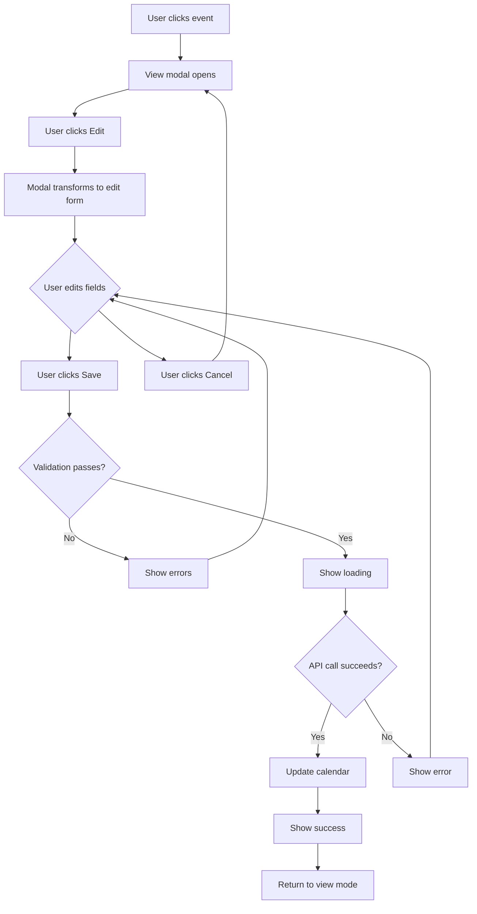
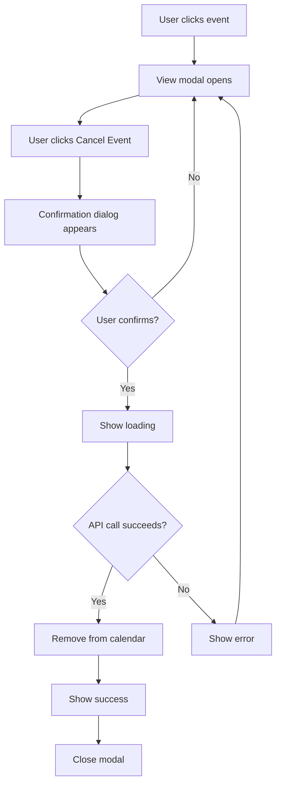

# Design Document: Calendar Event Management

## Overview

This design adds edit and cancel functionality to calendar events in the MDJ Practice Manager application. Currently, users can view event details in a modal but cannot modify or delete events. This enhancement will allow users to update event information and remove events that are no longer needed.

## Architecture

### Current State

The calendar system consists of:
- **Frontend**: React component (`apps/web/src/app/calendar/page.tsx`) using FullCalendar library
- **Backend**: NestJS API with CalendarService and CalendarController
- **Storage**: File-based JSON storage for calendar events
- **Event Modal**: Displays event details in a popup with "Close" button

**Current Limitations:**
1. No edit functionality - users cannot modify event details
2. No delete/cancel functionality - users cannot remove events
3. Event modal only shows read-only information
4. "Edit Event" button shows placeholder alert

### Target State

1. Event modal with "Edit" and "Cancel Event" buttons
2. Edit mode transforms modal into editable form
3. Form validation for all editable fields
4. API integration for update and delete operations
5. Optimistic UI updates with error handling
6. Confirmation dialog for event cancellation
7. Loading states and user feedback

## Components and Interfaces

### 1. Calendar Page Component Enhancement

**Location**: `apps/web/src/app/calendar/page.tsx`

**New State Variables**:
```typescript
const [isEditing, setIsEditing] = useState(false);
const [editedEvent, setEditedEvent] = useState<CalendarEvent | null>(null);
const [deleting, setDeleting] = useState(false);
const [showDeleteConfirm, setShowDeleteConfirm] = useState(false);
const [validationErrors, setValidationErrors] = useState<Record<string, string>>({});
```

**New Functions**:

```typescript
// Switch to edit mode
function handleEditClick() {
  setIsEditing(true);
  setEditedEvent({ ...selectedEvent });
  setValidationErrors({});
}

// Cancel editing
function handleCancelEdit() {
  setIsEditing(false);
  setEditedEvent(null);
  setValidationErrors({});
}

// Validate form fields
function validateEventForm(event: CalendarEvent): Record<string, string> {
  const errors: Record<string, string> = {};
  
  // Validate title (Requirement 3.1)
  if (!event.title?.trim()) {
    errors.title = 'Title is required';
  }
  
  // Validate start date (Requirement 3.2)
  if (!event.start) {
    errors.start = 'Start date is required';
  } else {
    const startDate = new Date(event.start);
    if (isNaN(startDate.getTime())) {
      errors.start = 'Start date is not a valid date';
    }
  }
  
  // Validate end date and time ordering (Requirement 3.2, 3.3)
  if (event.end) {
    const endDate = new Date(event.end);
    if (isNaN(endDate.getTime())) {
      errors.end = 'End date is not a valid date';
    } else if (event.start && new Date(event.start) >= endDate) {
      errors.end = 'End date must be after start date';
    }
  }
  
  return errors;
}

// Save edited event
async function handleSaveEdit() {
  if (!editedEvent) return;
  
  // Validate
  const errors = validateEventForm(editedEvent);
  if (Object.keys(errors).length > 0) {
    setValidationErrors(errors);
    return;
  }
  
  setSaving(true);
  try {
    const updated = await api.put(`/calendar/${editedEvent.id}`, {
      title: editedEvent.title,
      description: editedEvent.description,
      start: editedEvent.start,
      end: editedEvent.end,
      type: editedEvent.type,
      location: editedEvent.location,
      clientRef: editedEvent.clientRef,
      status: editedEvent.status,
    });
    
    // Update local state
    setEvents(prev => prev.map(e => e.id === updated.id ? updated : e));
    setSelectedEvent(updated);
    setIsEditing(false);
    setEditedEvent(null);
    
    // Show success message
    alert('Event updated successfully!');
  } catch (err: any) {
    setError(err?.message || 'Failed to update event');
  } finally {
    setSaving(false);
  }
}

// Show delete confirmation
function handleDeleteClick() {
  setShowDeleteConfirm(true);
}

// Cancel delete
function handleCancelDelete() {
  setShowDeleteConfirm(false);
}

// Confirm and delete event
async function handleConfirmDelete() {
  if (!selectedEvent) return;
  
  setDeleting(true);
  try {
    await api.delete(`/calendar/${selectedEvent.id}`);
    
    // Remove from local state
    setEvents(prev => prev.filter(e => e.id !== selectedEvent.id));
    setSelectedEvent(null);
    setShowDeleteConfirm(false);
    
    // Show success message
    alert('Event cancelled successfully!');
  } catch (err: any) {
    setError(err?.message || 'Failed to cancel event');
  } finally {
    setDeleting(false);
  }
}
```

### 2. Event Modal - View Mode

**Current Implementation**: Already exists, showing read-only event details

**Enhancement**: Add action buttons at the bottom

```tsx
<div className="modal-actions">
  <button
    type="button"
    className="btn-outline-gold"
    onClick={() => setSelectedEvent(null)}
  >
    Close
  </button>
  {!selectedEvent.id.startsWith('task-') && (
    <>
      <button
        type="button"
        className="btn-danger"
        onClick={handleDeleteClick}
      >
        Cancel Event
      </button>
      <button
        type="button"
        className="btn-gold"
        onClick={handleEditClick}
      >
        Edit Event
      </button>
    </>
  )}
</div>
```

### 3. Event Modal - Edit Mode

**New Implementation**: Transform modal into editable form

```tsx
{isEditing && editedEvent ? (
  <form onSubmit={(e) => { e.preventDefault(); handleSaveEdit(); }}>
    {/* Title field - Requirement 1.3, 3.1 */}
    <div className="form-group">
      <label className="label">Title *</label>
      <input
        type="text"
        className="input-mdj"
        value={editedEvent.title}
        onChange={(e) => setEditedEvent(prev => ({ ...prev, title: e.target.value }))}
        required
      />
      {validationErrors.title && (
        <span className="error-text">{validationErrors.title}</span>
      )}
    </div>
    
    {/* Start date/time field - Requirement 1.3, 3.2, 3.3 */}
    <div className="form-group">
      <label className="label">Start Date & Time *</label>
      <input
        type="datetime-local"
        className="input-mdj"
        value={editedEvent.start ? new Date(editedEvent.start).toISOString().slice(0, 16) : ''}
        onChange={(e) => setEditedEvent(prev => ({ ...prev, start: e.target.value }))}
        required
      />
      {validationErrors.start && (
        <span className="error-text">{validationErrors.start}</span>
      )}
    </div>
    
    {/* End date/time field - Requirement 1.3, 3.2, 3.3 */}
    <div className="form-group">
      <label className="label">End Date & Time</label>
      <input
        type="datetime-local"
        className="input-mdj"
        value={editedEvent.end ? new Date(editedEvent.end).toISOString().slice(0, 16) : ''}
        onChange={(e) => setEditedEvent(prev => ({ ...prev, end: e.target.value }))}
      />
      {validationErrors.end && (
        <span className="error-text">{validationErrors.end}</span>
      )}
    </div>
    
    {/* Description field - Requirement 1.3 */}
    <div className="form-group">
      <label className="label">Description</label>
      <textarea
        className="input-mdj"
        rows={3}
        value={editedEvent.description || ''}
        onChange={(e) => setEditedEvent(prev => ({ ...prev, description: e.target.value }))}
      />
    </div>
    
    {/* Type field - Requirement 1.3 */}
    <div className="form-group">
      <label className="label">Type</label>
      <select
        className="input-mdj"
        value={editedEvent.type || ''}
        onChange={(e) => setEditedEvent(prev => ({ ...prev, type: e.target.value }))}
      >
        <option value="">Select type...</option>
        <option value="meeting">Meeting</option>
        <option value="deadline">Deadline</option>
        <option value="reminder">Reminder</option>
        <option value="appointment">Appointment</option>
        <option value="filing">Filing</option>
      </select>
    </div>
    
    {/* Location field - Requirement 1.3 */}
    <div className="form-group">
      <label className="label">Location</label>
      <input
        type="text"
        className="input-mdj"
        value={editedEvent.location || ''}
        onChange={(e) => setEditedEvent(prev => ({ ...prev, location: e.target.value }))}
      />
    </div>
    
    {/* Client reference field - Requirement 1.3 */}
    <div className="form-group">
      <label className="label">Client Reference</label>
      <input
        type="text"
        className="input-mdj"
        value={editedEvent.clientRef || ''}
        onChange={(e) => setEditedEvent(prev => ({ ...prev, clientRef: e.target.value }))}
      />
    </div>
    
    {/* Status field - Requirement 1.3 */}
    <div className="form-group">
      <label className="label">Status</label>
      <select
        className="input-mdj"
        value={editedEvent.status || 'scheduled'}
        onChange={(e) => setEditedEvent(prev => ({ ...prev, status: e.target.value }))}
      >
        <option value="scheduled">Scheduled</option>
        <option value="completed">Completed</option>
        <option value="cancelled">Cancelled</option>
      </select>
    </div>
    
    {/* Action buttons - Requirements 4.1, 4.5, 5.1 */}
    <div className="modal-actions">
      <button
        type="button"
        className="btn-outline-gold"
        onClick={handleCancelEdit}
        disabled={saving}
      >
        Cancel
      </button>
      <button
        type="submit"
        className="btn-gold"
        disabled={saving}
      >
        {saving ? 'Saving...' : 'Save Changes'}
      </button>
    </div>
  </form>
) : (
  // View mode (existing implementation)
)}
```

### 4. Delete Confirmation Dialog

**New Component**: Confirmation modal for event cancellation

```tsx
{showDeleteConfirm && (
  <div className="modal-backdrop">
    <div className="modal card-mdj" style={{ maxWidth: 400 }}>
      <div className="modal-header">
        <h3>Cancel Event?</h3>
      </div>
      
      <p>Are you sure you want to cancel this event? This action cannot be undone.</p>
      
      <div className="modal-actions">
        <button
          type="button"
          className="btn-outline-gold"
          onClick={handleCancelDelete}
          disabled={deleting}
        >
          No, Keep Event
        </button>
        <button
          type="button"
          className="btn-danger"
          onClick={handleConfirmDelete}
          disabled={deleting}
        >
          {deleting ? 'Cancelling...' : 'Yes, Cancel Event'}
        </button>
      </div>
    </div>
  </div>
)}
```

### 5. API Integration

**Existing Endpoints** (already implemented in backend):

- `PUT /calendar/events/:id` - Update event
- `DELETE /calendar/events/:id` - Delete event

**Frontend API Calls**:

```typescript
// Update event
const updated = await api.put(`/calendar/${eventId}`, updateData);

// Delete event
await api.delete(`/calendar/${eventId}`);
```

**Note**: The backend API uses `/calendar/events/:id` but the frontend currently uses `/calendar/:id`. We need to align these.

## Data Models

### CalendarEvent (Frontend)

```typescript
interface CalendarEvent {
  id: string;
  title: string;
  description?: string;
  status: 'scheduled' | 'completed' | 'cancelled';
  start: string; // ISO format
  end?: string; // ISO format
  location?: string;
  clientRef?: string;
  clientName?: string;
  createdAt?: string;
  updatedAt?: string;
  type?: CalendarType | null;
}
```

### UpdateCalendarEventDto (Backend)

```typescript
interface UpdateCalendarEventDto {
  title?: string;
  description?: string;
  startDate?: Date;
  endDate?: Date;
  allDay?: boolean;
  clientId?: string;
  taskId?: string;
  type?: 'MEETING' | 'DEADLINE' | 'REMINDER' | 'APPOINTMENT' | 'FILING';
  location?: string;
  attendees?: string[];
  status?: 'SCHEDULED' | 'CONFIRMED' | 'CANCELLED' | 'COMPLETED';
}
```

**Mapping Considerations**:
- Frontend uses `start`/`end` (ISO strings), backend uses `startDate`/`endDate` (Date objects)
- Frontend uses lowercase status values, backend uses uppercase
- Need to transform data when sending to API

## Error Handling

### Validation Errors

**Client-Side Validation** (Requirements 3.1-3.5):
1. Title required (non-empty) - validates that title field contains at least one non-whitespace character
2. Start date required - validates that a start date value is present
3. Date validity - validates that start and end dates are valid date objects
4. End date ordering - validates that end date is after start date (if end date provided)
5. Time format - datetime-local input type provides built-in browser validation for time format

**Rationale**: Using HTML5 datetime-local input type provides native browser validation for date and time format (including HH:MM time validation), reducing the need for custom time parsing logic while ensuring consistent UX across browsers.

**Display**:
- Show error messages below each invalid field (Requirement 3.4)
- Prevent form submission until all errors resolved (Requirement 3.5)
- Clear errors when user corrects the field
- Use red text styling for error messages to ensure visibility

### API Errors

**Update Errors**:
- Network error: "Unable to connect to server"
- 404: "Event not found"
- 400: "Invalid event data"
- 500: "Server error, please try again"

**Delete Errors**:
- Network error: "Unable to connect to server"
- 404: "Event not found"
- 500: "Server error, please try again"

**Error Display**:
- Show error message in modal
- Keep modal open so user can retry
- Provide "Try Again" option

## User Experience Flow

### Edit Flow



### Cancel Flow



## Testing Strategy

### Manual Testing

1. **Edit Event Test** (Requirements 1.1-1.5)
   - Click on calendar event
   - Click "Edit Event" button
   - Verify form shows with pre-filled values for all fields
   - Modify title, description, dates, type, location
   - Click "Save Changes"
   - Verify loading indicator appears on button (Requirement 4.1)
   - Verify event updates on calendar
   - Verify modal shows updated details
   - Verify success message displayed (Requirement 4.3)

2. **Edit Validation Test** (Requirements 3.1-3.5)
   - Enter edit mode
   - Clear title field
   - Click "Save Changes"
   - Verify error message "Title is required" appears below field (Requirement 3.4)
   - Verify form does not submit (Requirement 3.5)
   - Enter invalid date
   - Verify error message appears
   - Set end date before start date
   - Verify error message "End date must be after start date" appears
   - Enter invalid time format (if browser allows)
   - Verify validation error
   - Fix all errors
   - Verify errors clear when fields corrected
   - Save successfully

3. **Cancel Edit Test** (Requirements 5.1-5.5)
   - Enter edit mode
   - Make changes to multiple fields
   - Click "Cancel" button
   - Verify modal returns to view mode immediately (Requirement 5.2)
   - Verify changes were not saved (Requirement 5.3)
   - Verify original data still displayed (Requirement 5.5)
   - Verify no API call was made (check network tab) (Requirement 5.4)

4. **Delete Event Test** (Requirements 2.1-2.5)
   - Click on calendar event
   - Click "Cancel Event" button
   - Verify confirmation dialog appears (Requirement 2.2)
   - Click "No, Keep Event"
   - Verify modal returns to view mode
   - Click "Cancel Event" again
   - Click "Yes, Cancel Event"
   - Verify loading indicator appears (Requirement 4.2)
   - Verify event removed from calendar (Requirement 2.4)
   - Verify modal closes
   - Verify success message displayed (Requirement 4.3)

5. **Loading States Test** (Requirements 4.1, 4.2, 4.5)
   - Enter edit mode
   - Click "Save Changes"
   - Verify save button shows "Saving..." text
   - Verify both buttons are disabled during save
   - After save completes, verify buttons re-enabled
   - Click "Cancel Event"
   - Verify delete button shows loading text
   - Verify both buttons disabled during delete

6. **Error Handling Test** (Requirements 1.6, 2.5, 4.4)
   - Stop API server
   - Try to edit event
   - Verify clear error message displayed with reason
   - Verify modal stays open
   - Verify user can retry
   - Try to delete event
   - Verify clear error message displayed
   - Verify modal stays open
   - Restart API server
   - Verify operations work again

7. **Task Event Protection Test** (Requirements 1.1, 2.1)
   - Click on auto-task event (id starts with "task-")
   - Verify "Edit" button not shown
   - Verify "Cancel Event" button not shown
   - Verify only "Close" button available

### Unit Tests

**Test Cases**:

**Validation Tests** (Requirement 3.1-3.5):
- `validateEventForm()` returns error when title is empty
- `validateEventForm()` returns error when title is only whitespace
- `validateEventForm()` returns error when start date is missing
- `validateEventForm()` returns error when start date is invalid
- `validateEventForm()` returns error when end date is invalid
- `validateEventForm()` returns error when end date is before start date
- `validateEventForm()` returns empty object for valid data
- Validation errors clear when fields are corrected

**Edit Functionality Tests** (Requirements 1.1-1.6):
- `handleEditClick()` switches to edit mode
- `handleEditClick()` copies event data to editedEvent state
- `handleEditClick()` clears validation errors
- `handleSaveEdit()` validates form before API call
- `handleSaveEdit()` calls API with correct endpoint and data
- `handleSaveEdit()` updates local state on success
- `handleSaveEdit()` shows error message on failure
- `handleSaveEdit()` keeps modal open on error

**Cancel Edit Tests** (Requirements 5.1-5.5):
- `handleCancelEdit()` exits edit mode
- `handleCancelEdit()` clears editedEvent state
- `handleCancelEdit()` clears validation errors
- `handleCancelEdit()` does not call API
- Original event data preserved after cancel

**Delete Functionality Tests** (Requirements 2.1-2.5):
- `handleDeleteClick()` shows confirmation dialog
- `handleCancelDelete()` hides confirmation dialog
- `handleConfirmDelete()` calls API with correct endpoint
- `handleConfirmDelete()` removes event from state on success
- `handleConfirmDelete()` closes modal on success
- `handleConfirmDelete()` shows error message on failure

**Loading State Tests** (Requirements 4.1, 4.2, 4.5):
- Save button shows loading text during save
- Delete button shows loading text during delete
- Buttons are disabled during operations
- Buttons re-enable after operation completes

## Implementation Notes

### API Endpoint Alignment (Requirements 1.4, 2.3)

**Current Issue**: Frontend uses `/calendar/:id` but backend expects `/calendar/events/:id`

**Solution**: Update frontend API calls to use correct endpoint:
```typescript
// Before
await api.put(`/calendar/${id}`, data);
await api.delete(`/calendar/${id}`);

// After
await api.put(`/calendar/events/${id}`, data);
await api.delete(`/calendar/events/${id}`);
```

**Rationale**: Aligning the frontend and backend endpoints ensures API calls succeed and follows RESTful conventions where resource paths are consistent.

### Data Transformation (Requirements 1.4, 2.3)

**Frontend to Backend**:
```typescript
function transformToBackend(event: CalendarEvent) {
  return {
    title: event.title,
    description: event.description,
    startDate: event.start,
    endDate: event.end,
    type: event.type?.toUpperCase(),
    location: event.location,
    status: event.status?.toUpperCase(),
    clientId: event.clientRef,
    // Map other fields as needed
  };
}
```

**Backend to Frontend**:
```typescript
function transformFromBackend(event: any): CalendarEvent {
  return {
    id: event.id,
    title: event.title,
    description: event.description,
    start: event.startDate,
    end: event.endDate,
    type: event.type?.toLowerCase(),
    location: event.location,
    status: event.status?.toLowerCase(),
    clientRef: event.clientId,
    // Map other fields as needed
  };
}
```

**Rationale**: The backend uses different field names and case conventions (uppercase enums, `startDate`/`endDate` vs `start`/`end`). Transformation functions centralize this mapping logic and prevent errors from inconsistent data formats.

### Date and Time Handling (Requirements 3.2, 3.3)

**Input Type**: Using HTML5 `datetime-local` input type for date/time fields

**Benefits**:
- Native browser validation for date and time format (including HH:MM time validation per Requirement 3.3)
- Consistent date picker UI across the application
- Automatic handling of timezone display
- Reduces custom validation code

**Format Conversion**:
```typescript
// Convert ISO string to datetime-local format (YYYY-MM-DDTHH:mm)
const localDatetime = new Date(isoString).toISOString().slice(0, 16);

// datetime-local input automatically provides ISO format string on change
onChange={(e) => setEditedEvent(prev => ({ ...prev, start: e.target.value }))}
```

**Rationale**: The datetime-local input type provides built-in validation and a better user experience than separate date and time inputs or manual time parsing.

### Optimistic Updates (Requirements 1.5, 4.3)

For better UX, update the UI immediately and revert on error:

```typescript
// Save original state
const originalEvent = { ...selectedEvent };

// Update UI optimistically
setEvents(prev => prev.map(e => e.id === updated.id ? updated : e));
setSelectedEvent(updated);

try {
  await api.put(`/calendar/events/${id}`, data);
  // Show success message (Requirement 4.3)
} catch (err) {
  // Revert on error
  setEvents(prev => prev.map(e => e.id === originalEvent.id ? originalEvent : e));
  setSelectedEvent(originalEvent);
  throw err;
}
```

**Rationale**: Optimistic updates provide immediate visual feedback to users, making the interface feel more responsive. If the API call fails, we revert to the original state and show an error message, maintaining data consistency.

### Auto-Task Protection (Requirements 1.1, 2.1)

Events with IDs starting with "task-" are auto-generated from the tasks system and should not be editable or deletable from the calendar:

```typescript
const isAutoTask = selectedEvent.id.startsWith('task-');

// Don't show edit/delete buttons for auto-tasks
{!isAutoTask && (
  <>
    <button onClick={handleEditClick}>Edit Event</button>
    <button onClick={handleDeleteClick}>Cancel Event</button>
  </>
)}
```

**Rationale**: Auto-task events are synchronized from the task management system. Allowing edits or deletions from the calendar would create data inconsistencies. Users should manage these events through the task system instead.

## Security Considerations

1. **Validation** (Requirements 3.1-3.5): All input validated on both client and server to prevent invalid data
2. **Authorization**: Backend should verify user has permission to edit/delete event (prevents unauthorized modifications)
3. **Confirmation** (Requirement 2.2): Destructive action (delete) requires explicit confirmation to prevent accidental data loss
4. **Error Messages** (Requirement 4.4): Provide clear error messages without revealing sensitive system information
5. **Input Sanitization**: All user input should be sanitized to prevent XSS attacks
6. **CSRF Protection**: API endpoints should include CSRF tokens to prevent cross-site request forgery

## Success Criteria

All requirements from the requirements document must be satisfied:

**Requirement 1: Edit Event Functionality**
1. ✅ User can click event to see modal with "Edit" button (1.1)
2. ✅ Edit button transforms modal into edit form with pre-filled values (1.2, 1.3)
3. ✅ Save button updates event via API (1.4)
4. ✅ Calendar refreshes and shows updated event (1.5)
5. ✅ Error messages displayed on failure (1.6)

**Requirement 2: Cancel Event Functionality**
6. ✅ Modal displays "Cancel Event" button (2.1)
7. ✅ Confirmation dialog appears before deletion (2.2)
8. ✅ Event deleted via API on confirmation (2.3)
9. ✅ Calendar refreshes and removes event (2.4)
10. ✅ Error messages displayed on failure (2.5)

**Requirement 3: Form Validation**
11. ✅ Title validation (empty check) (3.1)
12. ✅ Date validation (valid date check) (3.2)
13. ✅ Time validation (HH:MM format via datetime-local input) (3.3)
14. ✅ Error messages shown for invalid fields (3.4)
15. ✅ Form submission prevented until errors resolved (3.5)

**Requirement 4: User Feedback and Loading States**
16. ✅ Loading indicator on save button (4.1)
17. ✅ Loading indicator during deletion (4.2)
18. ✅ Success messages on completion (4.3)
19. ✅ Clear error messages on failure (4.4)
20. ✅ Buttons disabled during processing (4.5)

**Requirement 5: Edit Form Cancellation**
21. ✅ Cancel button shown in edit form (5.1)
22. ✅ Cancel returns to view mode (5.2)
23. ✅ Changes discarded on cancel (5.3)
24. ✅ No API calls made on cancel (5.4)
25. ✅ Original data displayed after cancel (5.5)

**Additional Success Criteria**
26. ✅ Auto-task events protected from editing/deletion
27. ✅ Changes persist after page refresh
