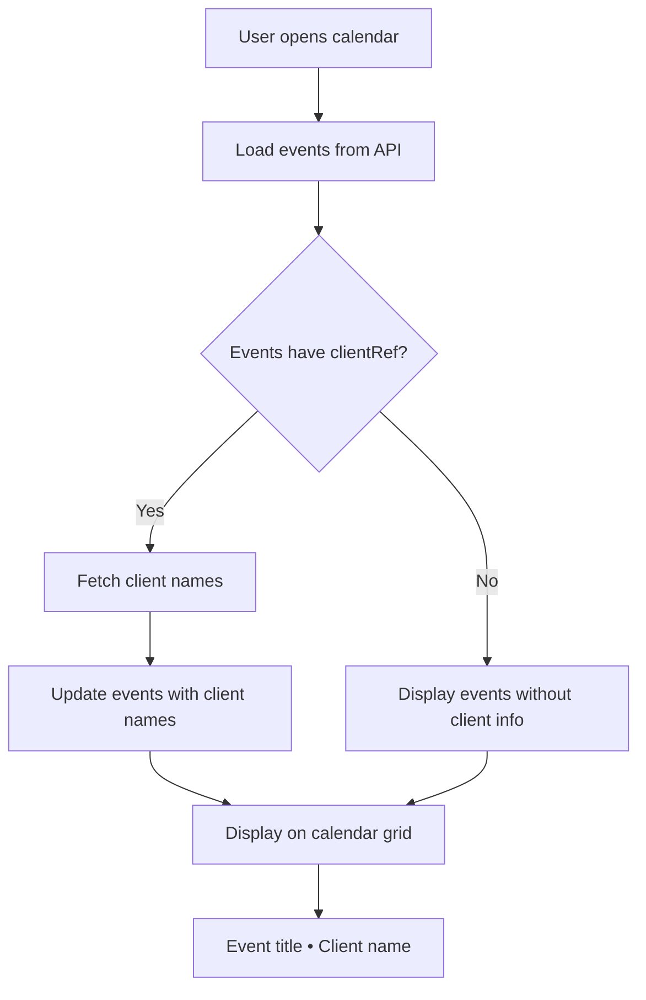
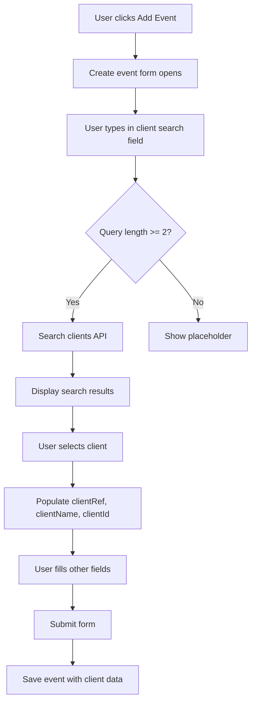
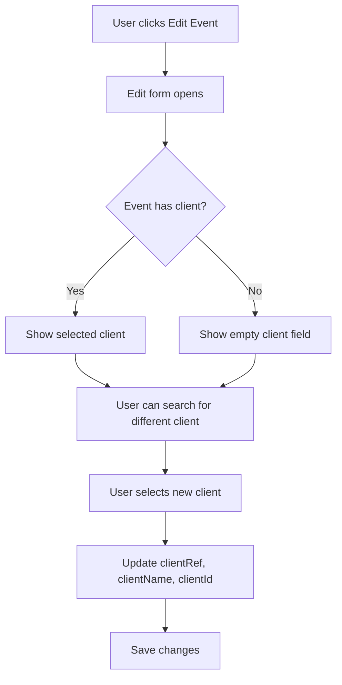

# Design Document: Client Name Display in Calendar and Tasks

## Overview

This design adds client name display functionality to calendar events and enhances the existing task list client display. Currently, calendar events show client references (IDs like "1A001") but not the human-readable client names. The task list already displays client names, but this design ensures consistency and adds client name display to the calendar grid and event details.

## Architecture

### Current State

**Calendar System:**
- Frontend: React component (`apps/web/src/app/calendar/page.tsx`)
- Backend: NestJS CalendarService with file-based storage
- Events store `clientRef` (client reference) and `clientName` (optional)
- Calendar grid shows event title only
- Event modal shows client reference but not prominently displayed with name

**Task System:**
- Frontend: React component (`apps/web/src/app/tasks/page.tsx`)
- Tasks already include `clientName` field
- Task list displays client names as clickable links
- Client names are searchable in task filters

**Client System:**
- Backend: NestJS ClientsService with file-based storage
- API endpoint: `GET /clients/:id` returns full client data
- API endpoint: `GET /clients/search?q=query` for searching clients
- Client data includes: `id`, `ref`, `name`, `type`, `portfolioCode`, etc.

### Target State

1. Calendar events display client names alongside titles on the calendar grid
2. Event modal shows both client reference and client name prominently
3. Event creation/edit form includes client selection dropdown with autocomplete
4. Client data is fetched and cached to minimize API calls
5. Consistent client display format across calendar and tasks
6. Client names are clickable links to client detail pages

## Components and Interfaces

### 1. Enhanced CalendarEvent Interface

**Location**: `apps/web/src/app/calendar/page.tsx`

**Current Interface**:
```typescript
interface CalendarEvent {
  id: string;
  title: string;
  description?: string;
  status: CalendarStatus;
  start: string;
  end?: string;
  location?: string;
  clientRef?: string;
  clientName?: string;  // Already exists but not consistently populated
  createdAt?: string;
  updatedAt?: string;
  type?: CalendarType | null;
}
```

**No changes needed** - the interface already supports `clientName`. We just need to ensure it's populated and displayed.

### 2. Client Data Fetching Hook

**New Hook**: `useClientData`

**Location**: `apps/web/src/hooks/useClientData.ts` (new file)

```typescript
interface ClientData {
  id: string;
  ref: string;
  name: string;
  type: string;
  portfolioCode: number;
}

interface UseClientDataReturn {
  clients: Map<string, ClientData>;
  loading: boolean;
  error: string | null;
  fetchClientByRef: (ref: string) => Promise<ClientData | null>;
  fetchClientById: (id: string) => Promise<ClientData | null>;
  searchClients: (query: string) => Promise<ClientData[]>;
}

export function useClientData(): UseClientDataReturn {
  const [clients, setClients] = useState<Map<string, ClientData>>(new Map());
  const [loading, setLoading] = useState(false);
  const [error, setError] = useState<string | null>(null);

  // Fetch client by reference (e.g., "1A001")
  const fetchClientByRef = async (ref: string): Promise<ClientData | null> => {
    // Check cache first
    const cached = Array.from(clients.values()).find(c => c.ref === ref);
    if (cached) return cached;

    setLoading(true);
    setError(null);
    
    try {
      // API call to get client by ref
      const client = await api.get<ClientData>(`/clients/${ref}`);
      
      // Update cache
      setClients(prev => new Map(prev).set(client.id, client));
      
      return client;
    } catch (err: any) {
      setError(err?.message || 'Failed to fetch client');
      return null;
    } finally {
      setLoading(false);
    }
  };

  // Fetch client by ID (UUID)
  const fetchClientById = async (id: string): Promise<ClientData | null> => {
    // Check cache first
    if (clients.has(id)) return clients.get(id)!;

    setLoading(true);
    setError(null);
    
    try {
      const client = await api.get<ClientData>(`/clients/${id}`);
      setClients(prev => new Map(prev).set(client.id, client));
      return client;
    } catch (err: any) {
      setError(err?.message || 'Failed to fetch client');
      return null;
    } finally {
      setLoading(false);
    }
  };

  // Search clients by name or reference
  const searchClients = async (query: string): Promise<ClientData[]> => {
    if (!query.trim()) return [];

    setLoading(true);
    setError(null);
    
    try {
      const results = await api.get<ClientData[]>(`/clients/search?q=${encodeURIComponent(query)}`);
      
      // Update cache with results
      setClients(prev => {
        const newMap = new Map(prev);
        results.forEach(client => newMap.set(client.id, client));
        return newMap;
      });
      
      return results;
    } catch (err: any) {
      setError(err?.message || 'Failed to search clients');
      return [];
    } finally {
      setLoading(false);
    }
  };

  return {
    clients,
    loading,
    error,
    fetchClientByRef,
    fetchClientById,
    searchClients,
  };
}
```

### 3. Client Selection Component

**New Component**: `ClientSelect`

**Location**: `apps/web/src/components/ClientSelect.tsx` (new file)

```typescript
interface ClientSelectProps {
  value?: string; // client ref or id
  onChange: (clientRef: string, clientName: string, clientId: string) => void;
  placeholder?: string;
  required?: boolean;
  disabled?: boolean;
}

export function ClientSelect({ value, onChange, placeholder, required, disabled }: ClientSelectProps) {
  const [query, setQuery] = useState('');
  const [results, setResults] = useState<ClientData[]>([]);
  const [showDropdown, setShowDropdown] = useState(false);
  const { searchClients, loading } = useClientData();

  // Debounced search
  useEffect(() => {
    const timer = setTimeout(async () => {
      if (query.length >= 2) {
        const clients = await searchClients(query);
        setResults(clients);
        setShowDropdown(true);
      } else {
        setResults([]);
        setShowDropdown(false);
      }
    }, 300);

    return () => clearTimeout(timer);
  }, [query]);

  const handleSelect = (client: ClientData) => {
    onChange(client.ref, client.name, client.id);
    setQuery(`${client.name} (${client.ref})`);
    setShowDropdown(false);
  };

  return (
    <div className="relative">
      <input
        type="text"
        className="input-mdj"
        placeholder={placeholder || "Search client by name or reference..."}
        value={query}
        onChange={(e) => setQuery(e.target.value)}
        onFocus={() => query.length >= 2 && setShowDropdown(true)}
        required={required}
        disabled={disabled}
      />
      
      {loading && (
        <div className="absolute right-3 top-3">
          <div className="spinner-sm" />
        </div>
      )}

      {showDropdown && results.length > 0 && (
        <div className="absolute z-10 w-full mt-1 bg-white border border-gray-300 rounded-md shadow-lg max-h-60 overflow-auto">
          {results.map(client => (
            <button
              key={client.id}
              type="button"
              className="w-full px-4 py-2 text-left hover:bg-gray-100 flex justify-between items-center"
              onClick={() => handleSelect(client)}
            >
              <span className="font-medium">{client.name}</span>
              <span className="text-sm text-gray-500 mono">{client.ref}</span>
            </button>
          ))}
        </div>
      )}

      {showDropdown && query.length >= 2 && results.length === 0 && !loading && (
        <div className="absolute z-10 w-full mt-1 bg-white border border-gray-300 rounded-md shadow-lg p-4 text-center text-gray-500">
          No clients found
        </div>
      )}
    </div>
  );
}
```

### 4. Calendar Page Enhancements

**Location**: `apps/web/src/app/calendar/page.tsx`

**Changes Required**:

#### 4.1 Add Client Data Hook

```typescript
export default function CalendarPage() {
  // ... existing state ...
  
  // Add client data hook
  const { fetchClientByRef, fetchClientById } = useClientData();
  
  // ... rest of component ...
}
```

#### 4.2 Enhance Event Loading to Fetch Client Names

```typescript
async function loadEvents() {
  setLoading(true);
  setError(null);
  try {
    const [calendarData, tasksData] = await Promise.all([
      api.get<CalendarEvent[]>('/calendar').catch(() => [] as CalendarEvent[]),
      api.get<any[]>('/tasks').catch(() => [] as any[]),
    ]);

    // Calendar events from API
    const calendarEvents: CalendarEvent[] = await Promise.all(
      (calendarData || []).map(async (e) => {
        // If event has clientRef but no clientName, fetch it
        if (e.clientRef && !e.clientName) {
          const client = await fetchClientByRef(e.clientRef);
          return {
            ...e,
            clientName: client?.name,
            type: (e.type as CalendarType) || 'OTHER',
          };
        }
        return {
          ...e,
          type: (e.type as CalendarType) || 'OTHER',
        };
      })
    );

    // Task events (already have clientName)
    const taskEvents: CalendarEvent[] = (Array.isArray(tasksData) ? tasksData : []).map(
      (task: any) => ({
        id: `task-${task.id}`,
        title: task.title,
        description: task.description || '',
        status: task.status === 'completed' ? 'completed' : 'scheduled',
        start: task.dueDate || new Date().toISOString(),
        end: undefined,
        location: task.clientName || '',
        clientName: task.clientName || '',
        clientRef: task.clientRef || '',
        type: 'TASK',
      }),
    );

    setEvents([...calendarEvents, ...taskEvents]);
  } catch (e: any) {
    console.warn('Failed to load calendar data:', e?.message || e);
    setEvents([]);
    setError('Failed to load calendar data.');
  } finally {
    setLoading(false);
  }
}
```

#### 4.3 Update Calendar Grid Display

```typescript
function mapToFullCalendarEvent(e: CalendarEvent) {
  const colour = typeColour((e.type as CalendarType) || 'OTHER');
  
  // Build display title with client name
  let displayTitle = e.title;
  if (e.clientName) {
    displayTitle = `${e.title} • ${e.clientName}`;
  }
  
  return {
    id: e.id,
    title: displayTitle,
    start: e.start,
    end: e.end,
    backgroundColor: colour,
    borderColor: colour,
  };
}
```

#### 4.4 Enhance Event Modal Display

Update the view mode section to prominently display client information:

```typescript
{(selectedEvent.clientRef || selectedEvent.clientName) && (
  <div 
    style={{ 
      padding: '1rem',
      border: '1px solid var(--border-color)',
      borderRadius: '8px',
      backgroundColor: 'white'
    }}
  >
    <label className="label" style={{ marginBottom: '0.5rem' }}>Client</label>
    <div style={{ fontSize: '0.95rem' }}>
      {selectedEvent.clientName ? (
        <Link 
          href={`/clients/${selectedEvent.clientRef || selectedEvent.clientId}`}
          className="mdj-link"
          style={{ fontWeight: 500 }}
        >
          {selectedEvent.clientName}
        </Link>
      ) : (
        <span className="mono">{selectedEvent.clientRef}</span>
      )}
      {selectedEvent.clientRef && selectedEvent.clientName && (
        <span className="text-gray-500 ml-2 mono text-sm">({selectedEvent.clientRef})</span>
      )}
    </div>
  </div>
)}
```

#### 4.5 Replace Client Reference Input with ClientSelect

In the edit form, replace the client reference text input:

```typescript
{/* Client Selection - Replace existing client reference input */}
<div>
  <label className="label">Client</label>
  <ClientSelect
    value={editedEvent.clientRef || ''}
    onChange={(clientRef, clientName, clientId) => {
      setEditedEvent(prev => ({
        ...prev!,
        clientRef,
        clientName,
        clientId,
      }));
    }}
    placeholder="Search for a client..."
    disabled={saving}
  />
  {editedEvent.clientName && (
    <div className="text-sm text-gray-600 mt-1">
      Selected: {editedEvent.clientName} ({editedEvent.clientRef})
    </div>
  )}
</div>
```

#### 4.6 Update Create Event Form

Similarly update the create event form to use ClientSelect:

```typescript
<div>
  <label className="label">Client</label>
  <ClientSelect
    value={newEvent.clientRef || ''}
    onChange={(clientRef, clientName, clientId) => {
      setNewEvent(p => ({
        ...p,
        clientRef,
        clientName,
        clientId,
      }));
    }}
    placeholder="Search for a client..."
    disabled={saving}
  />
</div>
```

## Data Models

### CalendarEvent (Frontend)

```typescript
interface CalendarEvent {
  id: string;
  title: string;
  description?: string;
  status: 'scheduled' | 'completed' | 'cancelled';
  start: string; // ISO format
  end?: string; // ISO format
  location?: string;
  clientRef?: string;      // Client reference (e.g., "1A001")
  clientName?: string;     // Client name (e.g., "Acme Corporation Ltd")
  clientId?: string;       // Client UUID (for API calls)
  createdAt?: string;
  updatedAt?: string;
  type?: CalendarType | null;
}
```

### Client (Backend)

```typescript
interface Client {
  id: string;              // UUID
  ref: string;             // Reference (e.g., "1A001")
  name: string;            // Company/person name
  type: 'COMPANY' | 'INDIVIDUAL' | 'SOLE_TRADER' | 'PARTNERSHIP' | 'LLP';
  portfolioCode: number;
  status: 'ACTIVE' | 'INACTIVE' | 'ARCHIVED';
  // ... other fields ...
}
```

### API Responses

**GET /clients/:id** or **GET /clients/:ref**:
```json
{
  "id": "uuid-here",
  "ref": "1A001",
  "name": "Acme Corporation Ltd",
  "type": "COMPANY",
  "portfolioCode": 1,
  "status": "ACTIVE",
  ...
}
```

**GET /clients/search?q=acme**:
```json
[
  {
    "id": "uuid-1",
    "ref": "1A001",
    "name": "Acme Corporation Ltd",
    "type": "COMPANY",
    "portfolioCode": 1
  },
  {
    "id": "uuid-2",
    "ref": "1A002",
    "name": "Acme Services Ltd",
    "type": "COMPANY",
    "portfolioCode": 1
  }
]
```

## Error Handling

### Client Not Found

**Scenario**: Event has `clientRef` but client doesn't exist in database

**Handling**:
```typescript
const client = await fetchClientByRef(e.clientRef);
if (!client) {
  // Display reference with indicator
  return {
    ...e,
    clientName: `${e.clientRef} (Not Found)`,
  };
}
```

**Display**: Show reference with "(Not Found)" indicator in red text

### Network Errors

**Scenario**: API call fails due to network issues

**Handling**:
- Display error message: "Failed to load client data"
- Provide retry button
- Show client reference as fallback
- Don't block calendar from loading

### Invalid Client Reference

**Scenario**: User enters invalid client reference in form

**Handling**:
- ClientSelect component shows "No clients found"
- Form validation prevents submission
- Error message: "Please select a valid client"

### Missing Client Data

**Scenario**: Event has neither `clientRef` nor `clientName`

**Handling**:
- Don't display client section in event modal
- Calendar grid shows event title only (no client name appended)
- No error displayed (this is valid state)

## User Experience Flow

### Viewing Calendar with Client Names



### Creating Event with Client



### Editing Event Client



## Testing Strategy

### Manual Testing

1. **Calendar Grid Display** (Requirements 1.1, 4.1-4.5)
   - Create events with and without clients
   - Verify client names appear on calendar grid
   - Verify format: "Event Title • Client Name"
   - Check all calendar views (month, week, day)
   - Verify text truncation for long titles

2. **Event Modal Display** (Requirements 1.2, 3.1-3.5)
   - Click on event with client
   - Verify client name displayed prominently
   - Verify client reference shown in parentheses
   - Verify client name is clickable link
   - Click link and verify navigation to client page

3. **Client Selection** (Requirements 6.1-6.5)
   - Open create event form
   - Type in client search field
   - Verify search results appear
   - Verify results show name and reference
   - Select a client
   - Verify client data populated correctly
   - Submit form and verify event created with client

4. **Client Data Fetching** (Requirements 2.1-2.5)
   - Load calendar with events that have clientRef
   - Verify client names fetched automatically
   - Check network tab for API calls
   - Verify caching (same client not fetched twice)
   - Test with invalid client reference
   - Verify error handling

5. **Edit Client Association** (Requirements 1.4, 6.1-6.5)
   - Edit event with client
   - Change to different client
   - Save and verify new client name displayed
   - Edit event without client
   - Add client and verify it appears
   - Remove client and verify it's removed

6. **Consistency** (Requirements 3.1-3.5, 5.1-5.5)
   - Compare client display in calendar vs tasks
   - Verify same format used
   - Verify same styling
   - Verify both have clickable links
   - Verify both are searchable

7. **Error Handling** (Requirements 8.1-8.5)
   - Create event with invalid client reference
   - Verify error message
   - Stop API server
   - Try to load calendar
   - Verify error message and retry option
   - Verify calendar still displays (graceful degradation)

### Unit Tests

**Client Data Hook Tests**:
- `fetchClientByRef()` returns client data
- `fetchClientByRef()` uses cache on second call
- `fetchClientById()` returns client data
- `searchClients()` returns search results
- Error handling for failed API calls
- Loading states managed correctly

**ClientSelect Component Tests**:
- Renders input field
- Triggers search on typing
- Displays search results
- Calls onChange when client selected
- Shows loading indicator during search
- Shows "No clients found" message
- Debounces search requests

**Calendar Page Tests**:
- Events with clientRef fetch client names
- Calendar grid displays client names
- Event modal shows client information
- Client selection updates event data
- Client links navigate to client page

## Implementation Notes

### Performance Optimization

**Client Data Caching** (Requirement 2.5):
- Use Map to cache client data by ID
- Check cache before making API calls
- Cache persists for session duration
- Reduces API calls for frequently viewed clients

**Debounced Search** (Requirement 6.4):
- 300ms debounce on client search input
- Prevents excessive API calls while typing
- Improves performance and user experience

**Lazy Loading**:
- Only fetch client names for visible events
- Don't fetch for events outside current view
- Fetch on-demand when event modal opened

### Data Synchronization

**Client Name Updates** (Requirement 7.4):
- Client names stored with events for performance
- If client name changes in database, events show old name
- Consider periodic sync or cache invalidation
- Alternative: Always fetch fresh on event view (slower but always current)

**Recommendation**: Store client name with event for performance, add manual "Refresh Client Data" button if needed

### Backward Compatibility

**Existing Events**:
- Events may have `clientRef` but no `clientName`
- Fetch client name on load
- Update event record with client name for future loads
- Gracefully handle events with neither field

### API Endpoint Usage

**Client Lookup**:
- `GET /clients/:id` - Works with both UUID and reference
- Backend checks if parameter is UUID or reference format
- Returns full client data

**Client Search**:
- `GET /clients/search?q=query` - Searches name and reference
- Returns array of matching clients
- Limit results to 10 for dropdown display

## Security Considerations

1. **Authorization**: Verify user has permission to view client data
2. **Input Validation**: Sanitize search queries to prevent injection
3. **Rate Limiting**: Limit client search API calls to prevent abuse
4. **Data Privacy**: Only expose necessary client fields in search results
5. **Link Security**: Validate client IDs before navigation

## Success Criteria

All requirements from the requirements document must be satisfied:

**Requirement 1: Display Client Names in Calendar Events**
1. ✅ Client names displayed alongside event titles on calendar grid (1.1)
2. ✅ Event modal shows both client reference and name (1.2)
3. ✅ New events fetch client name when reference entered (1.3)
4. ✅ Editing client reference updates displayed name (1.4)
5. ✅ Events without clients don't show client info (1.5)

**Requirement 2: Fetch Client Data for Calendar Events**
6. ✅ Calendar loads and fetches client details (2.1)
7. ✅ Client reference input validates and fetches name (2.2)
8. ✅ Invalid references show error message (2.3)
9. ✅ Loading indicator shown during fetch (2.4)
10. ✅ Client data cached to minimize API calls (2.5)

**Requirement 3: Consistent Client Display Format**
11. ✅ Client name shown as primary identifier (3.1)
12. ✅ Format: "Client Name (Reference)" (3.2)
13. ✅ Reference-only shows with label (3.3)
14. ✅ Consistent styling across views (3.4)
15. ✅ Client names are clickable links (3.5)

**Requirement 4: Calendar Grid Display Enhancement**
16. ✅ Client name appended to event title (4.1)
17. ✅ Visual separator used (•) (4.2)
18. ✅ Long text truncated with ellipsis (4.3)
19. ✅ Visible in all calendar views (4.4)
20. ✅ Readable font sizes and colors (4.5)

**Requirement 5: Task List Client Display Verification**
21. ✅ Task list displays client names (5.1)
22. ✅ Client names are clickable links (5.2)
23. ✅ Tasks without clients show placeholder (5.3)
24. ✅ Consistent formatting (5.4)
25. ✅ Client names searchable (5.5)

**Requirement 6: Edit Form Client Selection**
26. ✅ Client selection dropdown/autocomplete (6.1)
27. ✅ Shows names with references (6.2)
28. ✅ Populates all client fields on selection (6.3)
29. ✅ Supports search by name or reference (6.4)
30. ✅ "No client" option available (6.5)

**Requirement 7: Data Persistence**
31. ✅ Events store client ID and name (7.1)
32. ✅ Updates store both fields (7.2)
33. ✅ Retrieval includes client name (7.3)
34. ✅ Names synchronized with database (7.4)
35. ✅ Updated names reflected in events (7.5)

**Requirement 8: Error Handling for Client Data**
36. ✅ Not found indicator displayed (8.1)
37. ✅ Network errors show retry option (8.2)
38. ✅ Invalid references prevent submission (8.3)
39. ✅ Errors logged for debugging (8.4)
40. ✅ Graceful handling of missing data (8.5)
