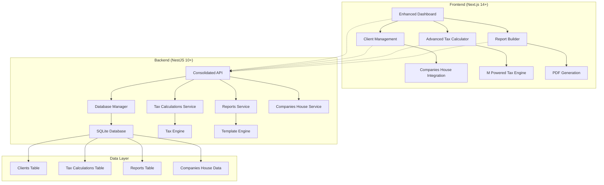

# Design Document

## Overview

This design outlines the consolidation and enhancement of M Practice Manager by integrating the most valuable components from the other software builds in the workspace. The primary goals are to:

1. Replace the current file-based tax calculation system with the advanced M Powered Tax Engine from v2
2. Consolidate data storage using the robust DatabaseManager from Client List
3. Integrate professional report generation capabilities from M Client Reports Builder
4. Remove disconnected JSON files and improve system maintainability
5. Enhance the dashboard with unified insights from all integrated components

The design maintains the existing Next.js/NestJS architecture while significantly improving the underlying data management and calculation capabilities.

## Architecture

### Current State Analysis

**M Practice Manager (Main System)**
- ✅ Next.js 14+ frontend with App Router
- ✅ NestJS 10+ backend with modular architecture
- ✅ Companies House integration
- ✅ Basic tax calculations
- ❌ File-based JSON storage (needs consolidation)
- ❌ Limited tax calculation capabilities

**M Practice Manager v2**
- ✅ Advanced M Powered Tax Engine with marginal relief calculations
- ✅ Comprehensive salary/dividend optimization
- ✅ SQLite database integration
- ❌ No frontend implementation
- ❌ Limited to API-only

**Client List**
- ✅ Robust DatabaseManager with proper error handling
- ✅ Centralized SQLite operations
- ✅ Companies House data synchronization
- ❌ Python-based (needs TypeScript port)
- ❌ No web interface

**M Client Reports Builder**
- ✅ Professional PDF generation with Puppeteer
- ✅ Modern React components and styling
- ✅ Tauri desktop app capabilities
- ❌ Limited integration with practice data
- ❌ Standalone system

### Target Architecture



## Components and Interfaces

### 1. Enhanced Database Manager

**Source**: Client List `core/database.py` → TypeScript port

```typescript
interface DatabaseManager {
  // Connection management
  getConnection(): Promise<sqlite3.Database>
  executeQuery<T>(query: string, params?: any[]): Promise<QueryResult<T>>
  
  // Client operations
  getClientByNumber(companyNumber: string): Promise<Client | null>
  searchClientsByName(name: string, limit?: number): Promise<Client[]>
  addClient(clientData: Partial<Client>): Promise<OperationResult>
  updateClient(companyNumber: string, updates: Partial<Client>): Promise<OperationResult>
  
  // Tax calculation operations
  storeCalculation(calculation: TaxCalculationResult): Promise<OperationResult>
  getClientCalculations(clientId: string, limit?: number): Promise<TaxCalculationResult[]>
  
  // Report operations
  storeReport(report: GeneratedReport): Promise<OperationResult>
  getClientReports(clientId: string): Promise<GeneratedReport[]>
}

interface QueryResult<T> {
  success: boolean
  data?: T[]
  error?: string
  rowCount: number
}
```

### 2. M Powered Tax Engine

**Source**: M Practice Manager v2 `tax-calculations.service.ts`

```typescript
interface TaxCalculationsService {
  // Salary optimization
  calculateOptimalSalary(params: SalaryOptimizationParams): Promise<TaxCalculationResult>
  compareScenarios(scenarios: TaxScenario[], params: TaxCalculationParams): Promise<TaxCalculationResult>
  
  // Individual calculations
  calculateCorporationTax(profit: number, taxYear: string): Promise<CorporationTaxResult>
  calculateDividendTax(dividend: number, otherIncome: number, taxYear: string): Promise<DividendTaxResult>
  calculateIncomeTax(salary: number, taxYear: string): Promise<IncomeTaxResult>
  
  // Data management
  getCalculation(id: string): Promise<TaxCalculationResult>
  getClientCalculations(clientId: string): Promise<TaxCalculationResult[]>
  getLatestCalculation(clientId: string): Promise<TaxCalculationResult | null>
}

interface TaxCalculationResult {
  id: string
  clientId: string
  companyId?: string
  calculationType: 'SALARY_OPTIMIZATION' | 'SCENARIO_COMPARISON'
  taxYear: string
  optimizedSalary: number
  optimizedDividend: number
  totalTakeHome: number
  totalTaxLiability: number
  estimatedSavings: number
  scenarios: TaxScenario[]
  recommendations: TaxRecommendation[]
  calculatedAt: Date
  calculatedBy: string
}
```

### 3. Professional Report Builder

**Source**: M Client Reports Builder components and PDF generation

```typescript
interface ReportBuilderService {
  // Report generation
  generateClientPack(clientId: string, calculationId?: string): Promise<GeneratedReport>
  generateTaxStrategyReport(calculationId: string): Promise<GeneratedReport>
  generateCompanyProfileReport(companyNumber: string): Promise<GeneratedReport>
  
  // Template management
  getAvailableTemplates(): Promise<ReportTemplate[]>
  createCustomTemplate(template: ReportTemplate): Promise<OperationResult>
  
  // Export options
  exportToPDF(reportId: string): Promise<Buffer>
  exportToHTML(reportId: string): Promise<string>
}

interface GeneratedReport {
  id: string
  clientId: string
  calculationId?: string
  templateId: string
  title: string
  content: ReportContent
  generatedAt: Date
  generatedBy: string
  format: 'PDF' | 'HTML'
  filePath?: string
}
```

### 4. Enhanced Dashboard Service

**Source**: M Client Reports Builder `Dashboard.tsx` + consolidated data

```typescript
interface DashboardService {
  // Statistics
  getStatistics(): Promise<DashboardStats>
  getRecentActivity(limit?: number): Promise<ActivityItem[]>
  
  // Quick insights
  getClientOverview(): Promise<ClientOverview>
  getTaxCalculationSummary(): Promise<CalculationSummary>
  getReportGenerationStats(): Promise<ReportStats>
  
  // Performance metrics
  getPracticeMetrics(): Promise<PracticeMetrics>
}

interface DashboardStats {
  totalClients: number
  totalCompanies: number
  calculationsLast30Days: number
  reportsGenerated: number
  averageTaxSavings: number
  clientsWithOverdueAccounts: number
}
```

## Data Models

### Database Schema Migration

**From**: Multiple JSON files and inconsistent storage
**To**: Consolidated SQLite database with proper relationships

```sql
-- Enhanced clients table (consolidating practice and CH data)
CREATE TABLE clients (
  company_number TEXT PRIMARY KEY,
  company_name TEXT NOT NULL,
  trading_name TEXT,
  status TEXT,
  company_type TEXT,
  incorporation_date TEXT,
  registered_address TEXT,
  
  -- Practice fields
  corporation_tax_utr TEXT,
  vat_number TEXT,
  paye_reference TEXT,
  main_contact_name TEXT,
  telephone TEXT,
  email TEXT,
  client_manager TEXT,
  engagement_type TEXT,
  monthly_fee REAL,
  annual_fee REAL,
  
  -- Metadata
  created_at DATETIME DEFAULT CURRENT_TIMESTAMP,
  updated_at DATETIME DEFAULT CURRENT_TIMESTAMP,
  last_ch_refresh DATE
);

-- Tax calculations table (replacing JSON storage)
CREATE TABLE tax_calculations (
  id TEXT PRIMARY KEY,
  client_id TEXT NOT NULL,
  company_id TEXT,
  calculation_type TEXT NOT NULL,
  tax_year TEXT NOT NULL,
  parameters TEXT, -- JSON
  optimized_salary REAL,
  optimized_dividend REAL,
  total_take_home REAL,
  total_tax_liability REAL,
  estimated_savings REAL,
  recommendations TEXT, -- JSON
  calculated_at DATETIME DEFAULT CURRENT_TIMESTAMP,
  calculated_by TEXT,
  FOREIGN KEY (client_id) REFERENCES clients(company_number)
);

-- Tax scenarios table (detailed scenario data)
CREATE TABLE tax_scenarios (
  id TEXT PRIMARY KEY,
  calculation_id TEXT NOT NULL,
  scenario_name TEXT,
  salary REAL,
  dividend REAL,
  income_tax REAL,
  employee_ni REAL,
  employer_ni REAL,
  dividend_tax REAL,
  corporation_tax REAL,
  total_tax REAL,
  take_home REAL,
  effective_rate REAL,
  FOREIGN KEY (calculation_id) REFERENCES tax_calculations(id)
);

-- Generated reports table
CREATE TABLE generated_reports (
  id TEXT PRIMARY KEY,
  client_id TEXT NOT NULL,
  calculation_id TEXT,
  template_id TEXT,
  title TEXT NOT NULL,
  content TEXT, -- JSON
  format TEXT NOT NULL,
  file_path TEXT,
  generated_at DATETIME DEFAULT CURRENT_TIMESTAMP,
  generated_by TEXT,
  FOREIGN KEY (client_id) REFERENCES clients(company_number),
  FOREIGN KEY (calculation_id) REFERENCES tax_calculations(id)
);
```

### TypeScript Interfaces

```typescript
interface Client {
  companyNumber: string
  companyName: string
  tradingName?: string
  status: string
  companyType?: string
  incorporationDate?: string
  registeredAddress?: string
  
  // Practice fields
  corporationTaxUtr?: string
  vatNumber?: string
  payeReference?: string
  mainContactName?: string
  telephone?: string
  email?: string
  clientManager?: string
  engagementType?: string
  monthlyFee?: number
  annualFee?: number
  
  // Metadata
  createdAt: Date
  updatedAt: Date
  lastChRefresh?: Date
}

interface TaxScenario {
  id?: string
  salary: number
  dividend: number
  incomeTax: number
  employeeNI: number
  employerNI: number
  dividendTax: number
  corporationTax: number
  totalTax: number
  takeHome: number
  effectiveRate: number
  netCost: number
}
```

## Correctness Properties

*A property is a characteristic or behavior that should hold true across all valid executions of a system-essentially, a formal statement about what the system should do. Properties serve as the bridge between human-readable specifications and machine-verifiable correctness guarantees.*

<function_calls>
<invoke name="prework">
<parameter name="featureName">practice-manager-upgrade

### Property Reflection

After reviewing all properties identified in the prework analysis, I've identified several areas where properties can be consolidated or where redundancy exists:

**Consolidation Opportunities:**
- Properties 2.2 and 6.2 both deal with data migration integrity - these can be combined into a comprehensive migration property
- Properties 2.3 and 2.4 both address database operation consistency - these can be merged into a single database operation property
- Properties 3.4 and 3.5 both concern report metadata and relationships - these can be combined
- Properties 6.3 and 6.5 both address post-migration database usage - these can be consolidated

**Redundancy Elimination:**
- Property 1.3 (storing calculations) and Property 5.5 (storing calculation results) are essentially the same - keeping the more comprehensive 5.5
- Property 7.1 (client selection) and Property 7.3 (client updates) both test database consistency - combining into a broader data consistency property

### Consolidated Correctness Properties

**Property 1: Tax Calculation Mathematical Accuracy**
*For any* valid client profit amount and tax year, the salary optimization algorithm should produce mathematically correct results with proper marginal relief calculations, National Insurance thresholds, and dividend tax considerations
**Validates: Requirements 1.1, 5.1, 5.2**

**Property 2: Tax Scenario Comparison Consistency**
*For any* set of salary/dividend combinations, the system should generate accurate comparisons with correct mathematical relationships between take-home pay, effective tax rates, and total tax liability
**Validates: Requirements 1.2, 5.3**

**Property 3: Tax Calculation Display Completeness**
*For any* tax calculation result, the displayed breakdown should include all required components: corporation tax, National Insurance (employee and employer), dividend tax, and income tax
**Validates: Requirements 1.5**

**Property 4: Database Operation Consistency**
*For any* database operation, the system should return properly structured QueryResult objects with consistent success/error status and user-friendly error messages
**Validates: Requirements 2.3, 2.4**

**Property 5: Data Migration Integrity**
*For any* data migration operation, the system should preserve all valuable data while correctly identifying and handling redundant files, maintaining backup copies until verification is complete
**Validates: Requirements 2.2, 6.2, 6.4**

**Property 6: Database Consolidation Compliance**
*For any* data access operation, the system should use the centralized DatabaseManager and consolidated SQLite database, ensuring all operations follow the proper schema design
**Validates: Requirements 2.1, 6.3**

**Property 7: Report Generation Consistency**
*For any* client data and calculation results, the report builder should create valid PDF documents with consistent M branding, proper formatting of calculation data, and correct dynamic content substitution
**Validates: Requirements 3.1, 3.2, 3.3**

**Property 8: Report Metadata and Relationship Integrity**
*For any* generated report, the system should store proper metadata, maintain correct links between reports, clients, and calculations, and support multiple export formats
**Validates: Requirements 3.4, 3.5**

**Property 9: Dashboard Data Aggregation Accuracy**
*For any* dashboard request, the system should correctly aggregate metrics from all data sources, present activities in proper chronological order, and handle loading errors gracefully
**Validates: Requirements 4.1, 4.2, 4.5**

**Property 10: Tax Calculation Persistence and Retrieval**
*For any* tax calculation stored in the database, the system should maintain all detailed scenario data and allow complete retrieval with identical data integrity
**Validates: Requirements 1.3, 5.5**

**Property 11: Tax Recommendation Generation**
*For any* completed tax calculation, the system should generate actionable recommendations with potential savings calculations and implementation steps based on the optimization results
**Validates: Requirements 5.4**

**Property 12: File System Audit Accuracy**
*For any* storage system audit, the system should correctly identify connected versus disconnected JSON files and accurately classify files for migration or removal
**Validates: Requirements 6.1**

**Property 13: Cross-Module Data Consistency**
*For any* client data update or bulk operation, the system should maintain consistency across all modules using proper transaction management and reflect changes uniformly throughout the system
**Validates: Requirements 7.2, 7.3, 7.4**

## Error Handling

### Database Error Management

The system will implement comprehensive error handling for database operations:

```typescript
class DatabaseError extends Error {
  constructor(
    message: string,
    public readonly code: string,
    public readonly userMessage: string
  ) {
    super(message)
  }
}

// Error mapping for user-friendly messages
const ERROR_MAPPINGS = {
  'SQLITE_LOCKED': 'Database is currently busy. Please try again.',
  'SQLITE_CONSTRAINT': 'Data validation error. Please check your input.',
  'SQLITE_NOTFOUND': 'Database not found. Please contact your administrator.',
  'SQLITE_UNIQUE': 'A record with this identifier already exists.'
}
```

### Tax Calculation Error Handling

Tax calculations will include validation for:
- Valid tax year formats (YYYY-YY)
- Positive profit amounts
- Reasonable salary/dividend ranges
- Current tax rate availability

### Report Generation Error Handling

Report generation will handle:
- Missing client data gracefully
- Template processing errors
- PDF generation failures
- File system access issues

## Testing Strategy

### Dual Testing Approach

The system will implement both unit testing and property-based testing:

**Unit Tests:**
- Specific examples demonstrating correct behavior
- Edge cases and error conditions
- Integration points between components
- UI component behavior

**Property-Based Tests:**
- Universal properties using fast-check library (minimum 100 iterations)
- Mathematical correctness of tax calculations
- Data integrity across operations
- System behavior across all valid inputs

### Property-Based Testing Configuration

```typescript
// Example property test configuration
import fc from 'fast-check'

describe('Tax Calculation Properties', () => {
  it('Property 1: Tax Calculation Mathematical Accuracy', () => {
    fc.assert(fc.property(
      fc.record({
        profit: fc.float({ min: 1000, max: 1000000 }),
        taxYear: fc.constantFrom('2024-25', '2025-26'),
        clientId: fc.uuid()
      }),
      (params) => {
        const result = taxEngine.calculateOptimalSalary(params)
        // Verify mathematical correctness
        expect(result.totalTax).toBeGreaterThan(0)
        expect(result.optimizedSalary + result.optimizedDividend).toBeLessThanOrEqual(params.profit)
        // Verify marginal relief calculations are applied correctly
        if (params.profit > 50000 && params.profit < 250000) {
          expect(result.scenarios.some(s => s.corporationTax < params.profit * 0.25)).toBe(true)
        }
      }
    ), { numRuns: 100 })
  })
})
```

Each property-based test will be tagged with comments explicitly referencing the correctness property:
- Format: `**Feature: practice-manager-upgrade, Property {number}: {property_text}**`
- Each correctness property will be implemented by a single property-based test
- Tests will run a minimum of 100 iterations for thorough coverage

### Integration Testing

Integration tests will cover:
- Database migration processes
- Cross-module data flow
- Report generation end-to-end
- Companies House API integration
- File system operations

### Performance Testing

While not part of property-based testing, performance benchmarks will be established for:
- Database query response times
- Tax calculation processing speed
- Report generation duration
- Dashboard loading times

The testing strategy ensures comprehensive coverage while maintaining focus on correctness properties that can be verified through automated testing.